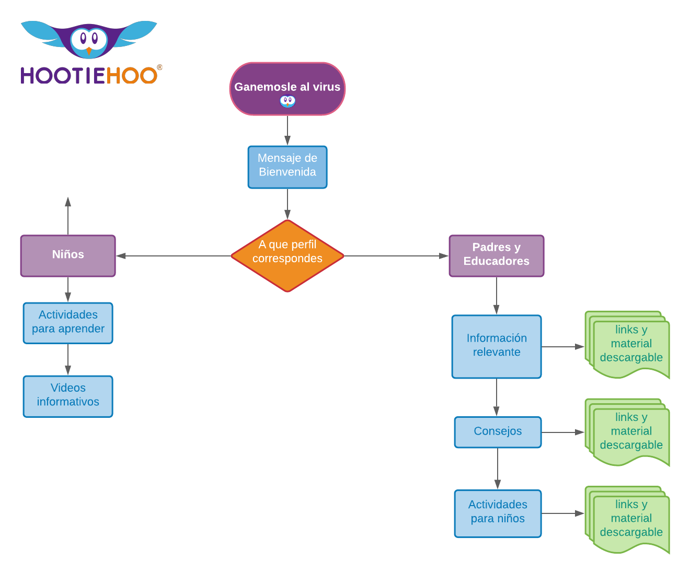

# covid-19_hootiehoo

## 1. Diagrama de flujo - Ganemosle al Virus

En el siguiente diagrama reconocemos las principales funciones que debe tener nuestro proyecto creado con ayuda de las principales Historias de usuarios.

## 2. Prototipo de Baja Fidelidad

## 3. Historias de Usuario

Autoras: Alejandra Colicheo / Dalia García / Yosliana Aguilar
Laboratoria / SCL 013 