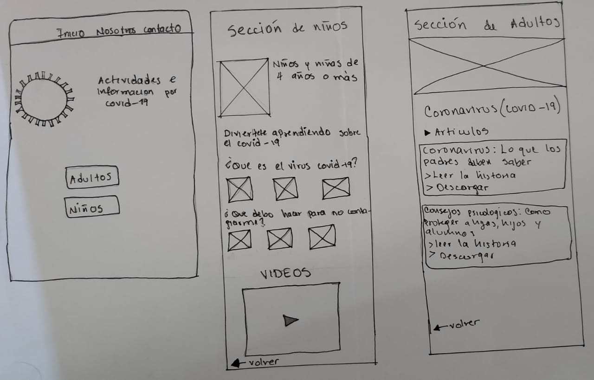
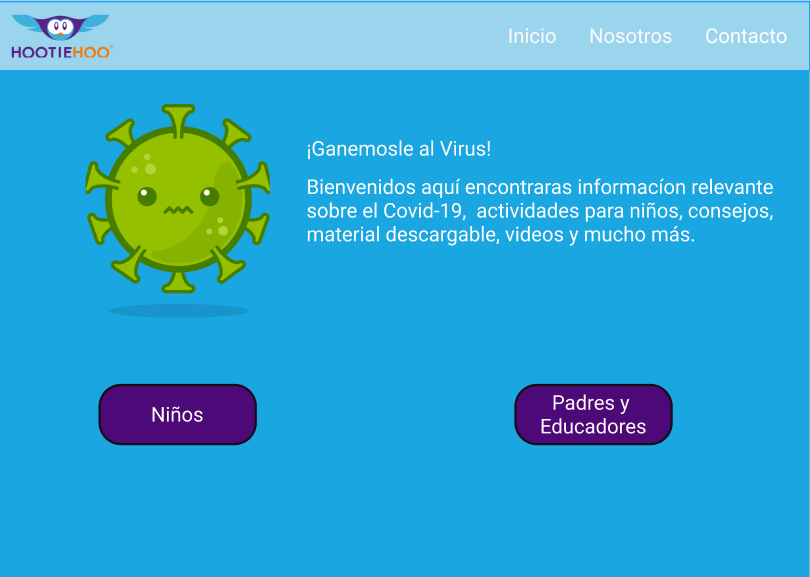
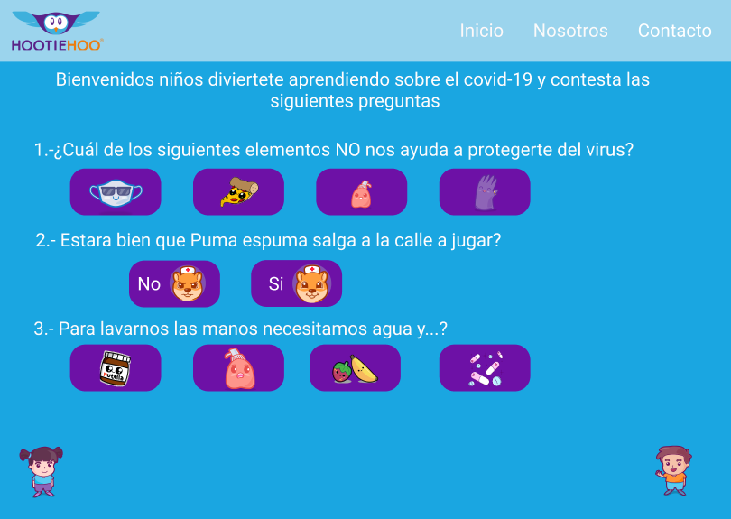
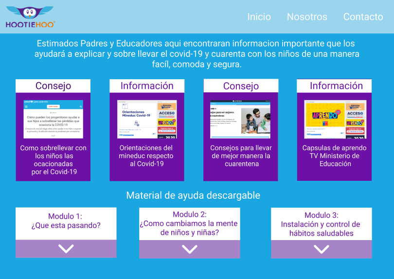
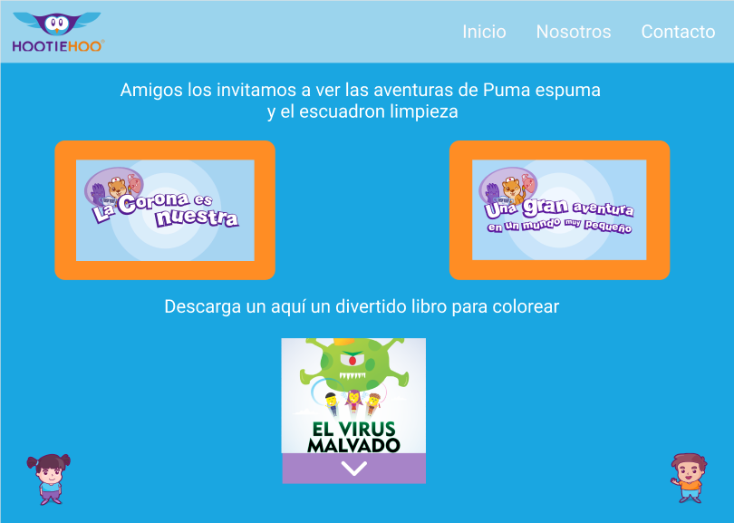

## Ganémosle al virus

### 1. Diagrama de flujo - Ganemosle al Virus

En el siguiente diagrama reconocemos las principales funciones que debe tener nuestro proyecto creado con ayuda de las principales Historias de usuarios.

### 2. Historias de Usuario

|                                                                   			**Historias de Usuarios** 		                                                                  |                                      			**Criterio de Aceptación** 		                                     |                                                                                			**Criterios de Terminado** 		                                                                              |
|:-------------------------------------------------------------------------------------------------------------------------------------------------------------:|:----------------------------------------------------------------------------------------------------:|:---------------------------------------------------------------------------------------------------------------------------------------------------------------------------------------:|
|  			**N.º 1** Yo 			como usuario quiero poder acceder al sitio web, según perfil de 			rango etario Perfil Adulto o  Perfil Niño. Para: Elegir el 			perfil 		              |  			Dado: El usuario elige un 			perfil adecuado a su rango etario. Cuando: Carga la intefaz.  			 		           |  			Entonces: El usuario accede 			al sitio web y ve la información relacionada a su edad. 			Terminado: El usuario obtiene información dependiendo de su del 			perfil elegido. 		                   |
|  			**N.º 2** Yo 			como usuario Adulto quiero poder encontrar la información 			clasificada en sección: Consejos Psicológicos 		                                        |  			Dado: el usuario selecciona 			consejos Psicológicos. Cuando:  Carga la interfaz  			 		                    |  			Entonces: El usuario lee 			información que necesita. Terminado: La web muestra consejos 			Psicológicos. 		                                                                                   |
|  			**N.º 3** Yo 			como usuario Adulto quiero poder encontrar la información 			clasificada en sección: links de sitios web con información 			veraz. 		                   |  			Dado: que el usuario 			selecciona la opción de información veraz.  			 		                                  |  			Entonces: la web muestra 			los link de lleva a información real sobre el covid-19. 			Terminado: El usuario puede acceder a los link que se encuentra la 			página. 		                           |
|  			**N.º 4** Yo 			como usuario Adulto quiero poder encontrar la información 			clasificada en sección: Material descargable de información 			referente al covid-19. 		   |  			Dado: que el usuario 			selecciona la opción descargable. Cuando: se inicia la descarga 			del material. 		 |  			Entonces: El materia 			descargable se guarda en la memoria de su computador listo para 			imprimir o usar desde la pc offline. Terminado: El usuario cuenta 			con el marial en su ordenador. 		 |
|  			**N.º 5** Yo 			como usuario Adulto quiero poder encontrar la información 			clasificada en sección: Material descargable con actividades 			lúdicas para los niños. 		 |  			Dado: que el usuario 			selecciona la opción descargable. Cuando: se inicia la descarga 			del material. 		 |  			Entonces: El materia 			descargable se guarda en la memoria de su computador listo para 			imprimir o usar desde la pc offline. Terminado: El usuario cuenta 			con el marial en su ordenador. 		 |
|  			**N.º 6** Yo 			como usuario menor quiero tener acceso a material acorde a mi 			edad:  Para: tener información referente al covid-19 		                             |  			Dado: que el usuario 			selecciona Perfil Infantil. Cuando: Carga el sitio web. 		                       |  			Entonces: se muestra 			información adecuada a su rango etario. Terminado: El usuario 			ingresa al perfil seleccionado. 		                                                                    |
|  			**N.º 7** Yo 			como usuario menor quiero tener acceso a material "Gamificado". 			 Para: aumentar mi conocimiento gradualmente sin sentirme 			frustrado 		            |  			Dado: que el usuario 			selecciona material Gamificado. Cuando: Carga la interfaz. 		                    |  			Entonces: la web muestra 			juego y videos sobre virus Covid-19. Terminado: El usuario ingresa 			a la opción de actividades interactiva. 		                                                   |
|  			**N.º 8** Yo 			como usuario menor quisiera poder divertirme mientras aprendo 			sobre el covid-19. 		                                                               |  			Dado: que el usuario 			selecciona jugos. Cuando: Carga la interfaz. 		                                  |  			Entonces: el usuario puede 			iniciar su aprendizaje a través del juego. Terminado: El usuario 			realiza actividades interactivas mientras aprende y se divierte.  			   			 		                     |

### 3. Prototipo de Baja Fidelidad

### 4. Prototipo de Alta Fidelidad

**Autoras:** Alejandra Colicheo / Dalia García / Yosliana Aguilar

Laboratoria / SCL 013